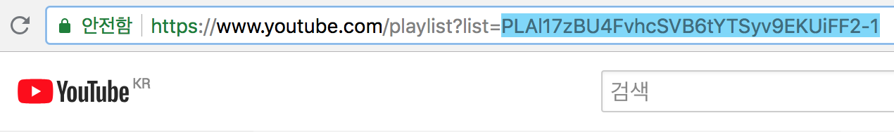

# Youtube 플레이리스트 다운로드

YouTube 플레이리스트에 등록된 영상을 모두 다운로드 하는 Python CLI 유틸리티 입니다.기본적으로 [Sublime Text 3 마스터 클래스 영상 강의](https://www.youtube.com/playlist?list=PLAl17zBU4FvhcSVB6tYTSyv9EKUiFF2-1)를 다운로드 합니다.

<br>

## 사용 환경 구성

사용자의 운영체제에 [python](https://www.python.org/)과 [PIP](https://pypi.org/project/pip/)가 설치되어 있어야 사용할 수 있습니다.

- Windows 사용자는 [Windows 환경에 Python 및 pip 설치하기](http://doocong.com/python/python-pip-install/)를 참고합니다.
- Mac OSX 사용자는 [맥 OS X에 파이썬 설치하기](http://python-guide-kr.readthedocs.io/ko/latest/starting/install/osx.html)를 참고합니다.

<br>

Python, PIP 설치가 마무리 되면 의존 개발 모듈인 [pytube](https://python-pytube.readthedocs.io/en/latest/)을 설치합니다.


```sh
$ pip install pytube
```

<br>

## 사용법

#### 유투브 플레이리스트 ID 구하기

Youtube 플레이리스트 URL 주소에서 ID 값을 복사할 수 있습니다.



<br>

#### 플레이리스트 다운로드 커멘드

복사한 ID 값을 `sh ypd.sh` 명령 뒤에 붙여 넣고 실행합니다.

```sh
# 사용법
# YoutubePlaylistDownload = ypd
# sh ypd.sh {플레이리스트 ID}

$ sh ypd.sh PLAl17zBU4FvhcSVB6tYTSyv9EKUiFF2-1
```

명령을 실행하면 다음과 같이 플레이리스트에 등록된 비디오를 다운로드 할지 물어봅니다. Enter를 누르면 모든 비디오 파일 다운로드를 시작합니다.

```sh
You are about to download 54 videos to /Users/yamoo9/Desktop/YoutubePlaylistDownload-CLI/temp
Would you like to continue? [Y/n]
```
